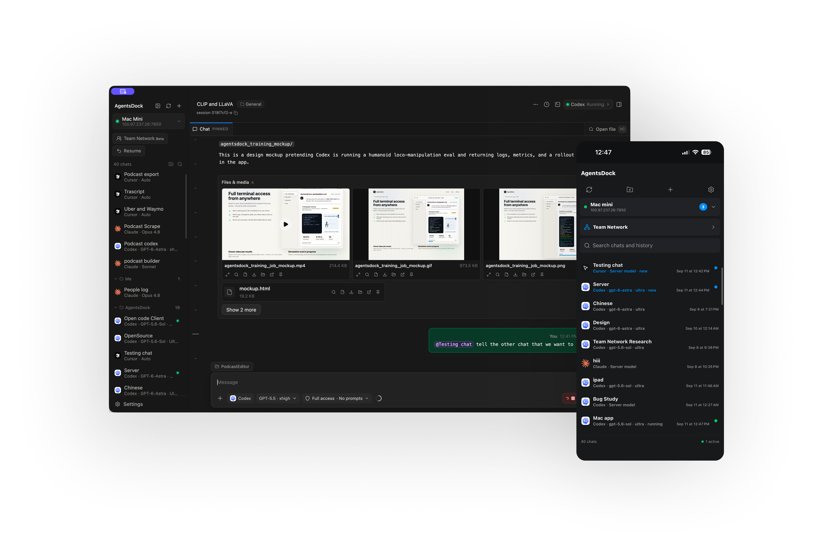

<h1 align="center">AgentsDock: an IDE designed for agentic AI research</h1>

<div align="center">
  <a href="https://agentsdock.net">
    
  </a>
  <a href="https://github.com/ZhengyiLuo/AgentsDock/releases/tag/v1.0.1">
    
  </a>
  <a href="https://discord.gg/ZGDrhEWqPt">
    
  </a>
  <a href="https://github.com/ZhengyiLuo/AgentsServer">
    
  </a>
  <a href="CONTRIBUTING.md">
    
  </a>
</div>

<p align="center">
  <a href="https://agentsdock.net">
    
  </a>
</p>

<div align="center">
  AgentsDock currently supports <strong>Claude Code</strong>,
  <strong>Codex</strong>, and <strong>Cursor</strong> in one desktop and mobile
  workspace. Use your agents for coding, research, and long-running work
  without living in a terminal. Easily review files and rich media.
  <br />
  <br />
  <strong>Desktop stable 1.0.1:</strong>
  <a href="https://github.com/ZhengyiLuo/AgentsDock/releases/download/v1.0.1/AgentsDock-1.0.1-mac-universal.dmg">macOS</a>
  ·
  <a href="https://github.com/ZhengyiLuo/AgentsDock/releases/download/v1.0.1/AgentsDock-1.0.1-linux-x86_64.AppImage">Linux x86_64</a>
  ·
  <a href="https://github.com/ZhengyiLuo/AgentsDock/releases/download/v1.0.1/AgentsDock-1.0.1-linux-arm64.AppImage">Linux ARM64</a>
  ·
  <a href="https://github.com/ZhengyiLuo/AgentsDock/releases/download/v1.0.1/AgentsDock-1.0.1-win-x64.exe">Windows (unsigned installer)</a>
  ·
  <a href="https://github.com/ZhengyiLuo/AgentsDock/releases">Release page</a>
  ·
  <a href="https://github.com/ZhengyiLuo/AgentsDock/releases/tag/v1.0.1">1.0.1 release notes</a>
  <br />
  <strong>Mobile:</strong>
  <a href="https://apps.apple.com/us/app/agentsdock/id6769275751">iPhone &amp; iPad</a>
  ·
  <a href="https://github.com/ZhengyiLuo/AgentsDock-Releases/releases/download/android-v0.1.1-beta.8/AgentsDock-0.1.1-android-arm64-beta.8.apk">Android</a>
  <br />
  <br />
  <strong>
    AgentsDock is the client;
    <a href="https://github.com/ZhengyiLuo/AgentsServer">AgentsServer</a>
    is the self-hosted backend.
  </strong>
</div>

## What you can do

- **Try OpenCode on desktop:** this beta branch adds optional OpenCode support
  with the matching server beta. Install and authenticate OpenCode on the
  server; see [setup and feature limits](electron/README.md#opencode-optional-beta-backend).
  Mobile support and published release availability are separate.
- **Work with your agents:** start and resume chats, follow live activity, and
  queue the next task.
- **Review the results:** view images and videos inline, browse files, inspect
  code changes, and download artifacts.
- **Keep long-running work organized:** group chats, search history, create
  digests, and schedule recurring jobs.
- **Open a real terminal:** use a persistent tmux terminal attached to each
  chat's workspace.
- **Move between devices and servers:** connect multiple clients to the same
  server, or manage several servers from one app.

## How it works

**AgentsDock is the client. [AgentsServer](https://github.com/ZhengyiLuo/AgentsServer)
is the backend.** Install the server on the machine that has your projects and
agent CLIs. That can be the same computer as the desktop app or a remote
machine you control. The desktop and mobile apps connect to it to send tasks
and display results.

The agent CLIs must be installed and authenticated **on the server**, not on
your phone. Self-hosting gives you control of the server and stored history;
it does not make the models local. Your selected provider still processes
model requests, and clients may cache content on your devices.

## Get started

1. **Install the app.** Get a desktop build from
   [public GitHub Releases](https://github.com/ZhengyiLuo/AgentsDock/releases)
   ([current stable](https://github.com/ZhengyiLuo/AgentsDock/releases/tag/v1.0.1)),
   or find the current iPhone/iPad distribution link on
   [the website](https://agentsdock.net/#downloads).
2. **Set up AgentsServer.** Direct macOS and Linux builds provide
   **Set up AgentsServer**. For other clients or manual installation, follow
   [the server's installation instructions](https://github.com/ZhengyiLuo/AgentsServer#guided-setup).
   Install and sign in to the agent CLI you want to use on that machine.
3. **Connect and start a chat.** Add the server connection in AgentsDock,
   choose an agent and a working directory on the server, and send a task.

For remote access, use a private network such as Tailscale rather than exposing
the server directly to the internet. The server needs `tmux` for persistent
terminals; see its documentation for the full prerequisites. Connection help
is in the [setup guide](https://agentsdock.net/setup.html).

## Develop from source

Use Git, **Node.js 24**, and **pnpm 11.9.0** (the version pinned by the project).
Desktop and mobile are separate packages; install dependencies in the package
you are working on. You also need a running AgentsServer to use the app.

```bash
git clone https://github.com/ZhengyiLuo/AgentsDock.git
cd AgentsDock
```

### Desktop

The current desktop app is built with Electron, React, and TypeScript. From
the repository root:

```bash
cd electron
pnpm install --frozen-lockfile
pnpm typecheck
pnpm test
pnpm dev
```

`pnpm build` compiles the app without packaging or publishing it. For desktop
architecture and platform-specific packaging, see
[electron/README.md](electron/README.md).

### Mobile: iPhone, iPad, and Android source

The current iPhone/iPad app lives in **`mobile-react/`**, using React Native
and Expo. Android source and native modules live in that same package. From
the repository root:

```bash
cd mobile-react
pnpm install --frozen-lockfile
pnpm typecheck
pnpm test:history
pnpm test:server-setup
```

For local iOS development on macOS with Xcode, continue in `mobile-react/`:

```bash
pnpm exec expo prebuild --platform ios
pnpm exec expo run:ios
```

Use a simulator or your own signing configuration. Read the
[mobile development guide](mobile-react/README.md) before installing on a
device: using the existing bundle identifier can replace your installed app.
Android development requires the Android toolchain.

### Website

The product site is plain HTML, CSS, and JavaScript. With Python 3 installed,
run this from the repository root:

```bash
cd website
npm run dev
```

Open `http://localhost:4175`. No website dependency installation is needed.

## Where things live

| Directory | Purpose |
| --- | --- |
| [`electron/`](electron/) | Current desktop client for macOS, Linux, and Windows |
| [`mobile-react/`](mobile-react/) | Current React Native mobile client, including native modules in `modules/` |
| [`website/`](website/) | Product website and user guides |
| [`team-hub/`](team-hub/) | Team Hub service code and tests |
| [`docs/`](docs/) | Architecture, development notes, and release-channel documentation |
| [`server/`](server/) | Maintained AgentsServer runtime, installer, and server-only tests |
| `Sources/`, `Apps/`, `ZenithDock.xcodeproj` | Legacy Swift clients, not the current Electron or React Native apps |

The maintained backend lives in `server/`. Its Python dependencies and installer
are self-contained; server users do not need to build either client. The
[AgentsServer repository](https://github.com/ZhengyiLuo/AgentsServer) remains the
legacy download and compatibility destination during migration. See
[the source migration notes](docs/SERVER_SOURCE_MIGRATION.md) before exporting
changes or preparing a coordinated release.

## Contributing

See [CONTRIBUTING.md](CONTRIBUTING.md) for checks and contribution guidelines.
Keep changes scoped and add regression tests where appropriate. Use synthetic
test data; do not commit credentials, private infrastructure details, chat
transcripts, or screenshots containing user data.

The repository's CI verifies source. It does not publish desktop releases,
upload mobile builds, or deploy servers. Official binaries and update feeds
are managed separately; see [release channels](docs/DIRECT_RELEASES.md).

## License

AgentsDock's original code is licensed under the [Apache License 2.0](LICENSE),
except where a component explicitly states another license. See [NOTICE](NOTICE)
for attribution and separately licensed components. Existing third-party
copyrights, licenses, and notices remain in effect.
